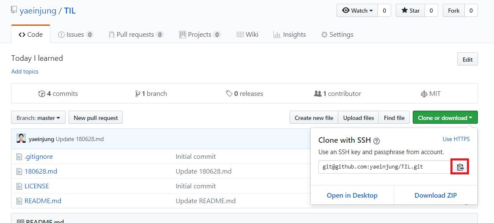

# Today I Learned
## 작은 제목
### 더 작은 제목

Github
* 생성
My repository ( TIL )
Daitgirls( TWL , tutorial ) ==fork==> My repository

# [Windows] Source Tree 에서 Github와 ssh 연결 실패시 해결방법

윈도우즈 source tree에서 깃허브 repository와 _"ssh key로 인증을 실패했습니다. Pageant를 어쩌고 저쩌고.."_ 에러가 나며 ssh 연결에 실패시 이를 해결하는 방법

* Source Tree 에서 `도구` - `SSH Key 생성 또는 불러오기` 클릭하면 다음과 같은 Putty Key Generator가 생성된다. `Generate`버튼을 눌러 키를 생성해준다.

 1.  1을 복사하여 github의 `settings` - `SSH and GPG Keys` 클릭후 `New SSH Key` 버튼을 누른 후 description에 붙여넣기 하여 ssh 키를 추가한다.

 2.  비밀번호를 생성한다. 내 마음대로!
 
 3. `Save private key` 버튼을 눌러 `.ppk`파일로 pc에 저장해준다.
 
 
* 내 pc 오른쪽 아래 화살표를 누른다.
* 모자쓴 컴퓨터 아이콘을 눌러준다.

* `Add Key` 버튼을 눌러 아까 저장한 `.ppk`파일을 불러온다.

* 추가한 후 모습

**거의 다 왔다..**

* 아까의 Source Tree를 열어 `Clone` 버튼을 누른다.

* 내 깃허브의 불러오고 싶은 repository에 들어가 Clone or download 버튼을 누른 후
* 빨간색 박스로 표시한 부분을 눌러 복사해준다.

* 클론 버튼을 누르면 끝!
